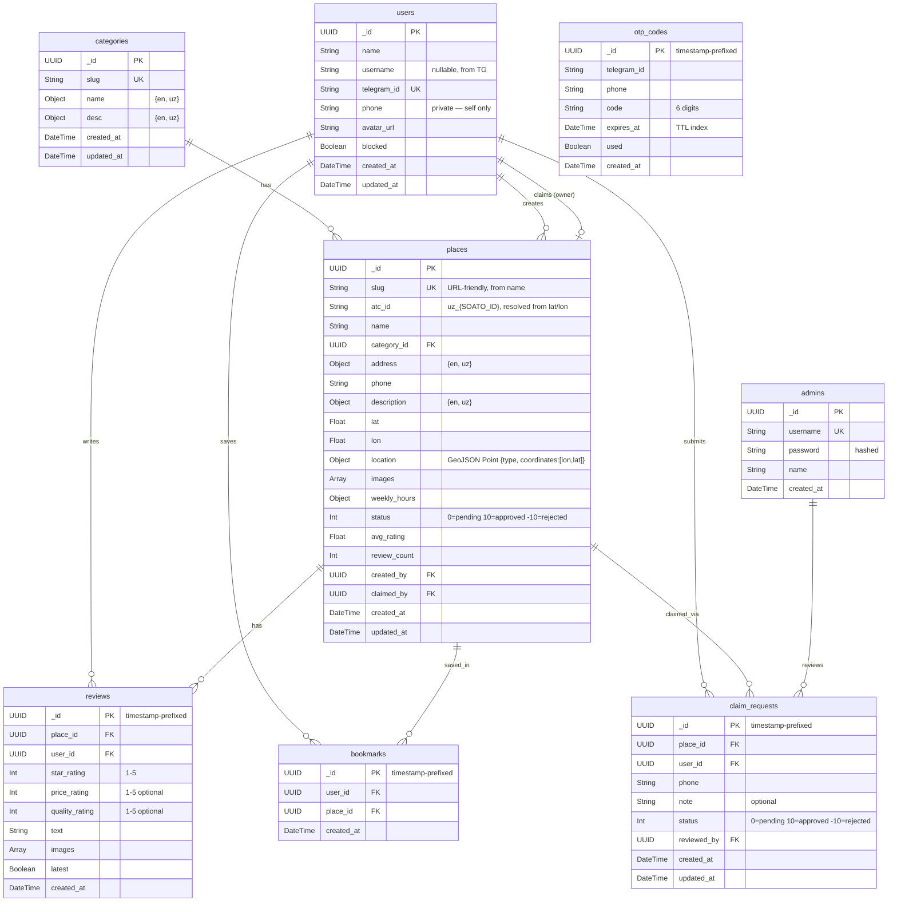

# BuYelpUz (s101) - Business Logic, Use Cases & Backend Structure

> A local review platform for Uzbekistan. Users discover places, read reviews, and leave ratings.
> Think **Yelp**, but focused on the Uzbek market with local categories like Choyxona and Tabiat.

---

## 1. Core Business Model

### How Listings Work (Yelp Model)

**Not every business owner will interact with the platform.** The listing model follows the same approach as Yelp:

1. **Any registered user can add a place.** You do not need to own a business to create a listing. If you visited a restaurant and it is not on the platform yet, you can add it yourself.
2. **Places go through moderation.** After submission, an s101 admin reviews the listing before it becomes publicly visible (status: `0/pending` -> `10/approved` or `-10/rejected`).
3. **Business owners can claim a listing.** If an owner finds their business already listed (added by a community member), they can submit a claim request with their phone number. An s101 admin contacts them to verify ownership. Once approved, the user gains edit access to that place's details.
4. **Unclaimed places remain community-managed.** The original contributor and s101 admins can edit unclaimed listings. Reviews and ratings are unaffected by claim status.

### Actors

| Actor | Description |
|-------|-------------|
| **guest** | Can browse places, search, view reviews. Cannot write reviews or add places. |
| **user** | Registered via Telegram. Can add places, write reviews, rate, bookmark, manage profile. If they have an approved claim, they see a "Business" section to manage their place. |
| **s101 admin** | Internal platform operator. **Separate collection** from users. Manages everything via **dashboard.buyelp.uz**. |

> **Note:** There is no "owner" role in the users collection. Ownership is determined by having an approved `claim_request` for a place. The `/api/auth/me` endpoint returns an `owns_place` boolean so the frontend (buyelp.uz) knows whether to show the Business section.

### Platforms

| Platform | URL | Audience |
|----------|-----|----------|
| **Main website** | buyelp.uz | Users & guests — browse, search, review, claim |
| **Admin dashboard** | dashboard.buyelp.uz | s101 internal admins — moderate places/reviews/users/claims |
| **TG Bot** | @BuYelpUzBot | Auth OTP delivery, user contact/phone collection |

---

## 2. Categories

Stored in the `categories` collection. Admins can edit `name` and `desc`, but the `slug` is immutable (used as stable identifier).

**Default categories** (created via seed code on app startup, upserted by `slug`):

| Slug | Name (EN) | Name (UZ) | Examples |
|------|-----------|-----------|----------|
| `restaurants` | Restaurants | Restoranlar | Choyxona, restaurants, cafes, fast food |
| `auto` | Auto Services | Avto Xizmatlar | Car repair, car wash, petrol stations, car rental |
| `health` | Health | Salomatlik | Clinics, hospitals, pharmacies, dental |
| `activities` | Activities | Faoliyatlar | Adventure parks, aqua parks, cinemas, amusement |
| `sports` | Sports | Sport | Gyms, stadiums, swimming pools, golf clubs |
| `tabiat` | Nature (Tabiat) | Tabiat | National parks, botanical gardens, hiking trails |

---

## 3. Use Cases

### UC-1: Authentication via Telegram OTP (Register & Login)

Authentication uses a **Telegram-based OTP flow** (similar to [42.uz](https://42.uz)). There is no email/password — since virtually all Uzbek users are on Telegram, this is the single auth method.

| Field | Detail |
|-------|--------|
| **Actor** | Guest |
| **Flow** | 1. User opens the login page on buyelp.uz. 2. Web app shows a **6-digit code input** field and a link to the @BuYelpUzBot Telegram bot. 3. User is redirected to the TG bot. 4. User **shares their contact** (phone number) with the bot via Telegram's built-in contact sharing. 5. Bot stores the phone number and TG username, generates a 6-digit OTP with a TTL (e.g., 5 min), and sends it to the user in chat. 6. User goes back to the website and enters the 6-digit code. 7. Backend looks up the OTP, finds the matching `telegram_id`. 8. **If the TG user already exists** -> login: refresh `username` from TG if changed, issue JWT (`typ: user`). **If new** -> register: create user record (name, username, telegram_id, phone from TG contact), then issue JWT. 9. User is redirected to home as authenticated. |
| **Postcondition** | User account exists (created if first time). User holds a valid JWT with `typ: user`. |
| **Notes** | No separate register vs login — single unified flow. First valid OTP from a new TG user auto-creates the account. The website only sends the 6-digit code to the backend (no need to send telegram_id — the OTP itself is the link). |

### UC-2: Logout

| Field | Detail |
|-------|--------|
| **Actor** | Authenticated user |
| **Flow** | 1. User clicks logout. 2. JWT is discarded client-side. |

### UC-3: Browse & Search Places

| Field | Detail |
|-------|--------|
| **Actor** | Any user (guest or registered) |
| **Flow** | 1. User opens home page or search page. 2. User can browse top-rated places, or enter a search query. 3. User can filter by category. 4. System returns matching places sorted by relevance. 5. User clicks a place to view its detail page. |

### UC-4: View Place Details

| Field | Detail |
|-------|--------|
| **Actor** | Any user |
| **Flow** | 1. User navigates to a place detail page. 2. System displays: name, category, address, phone, description, image gallery, weekly hours, open/closed status (derived from weekly_hours + current time), average rating, review count, location on map. 3. User can view all reviews (only latest per user shown by default). 4. User can click phone number to call directly. |

### UC-5: Add a New Place (Community-Driven)

| Field | Detail |
|-------|--------|
| **Actor** | Registered user |
| **Precondition** | User is logged in |
| **Flow** | 1. User clicks "Add a Place". 2. Fills in: name, category (selects from categories list), address `{en, uz}`, phone, description `{en, uz}`, weekly hours, lat/lon coordinates, images. 3. System validates data (all fields required). 4. System generates `slug` from `name` (URL-friendly, collision-suffixed if needed). 5. System resolves `atc_id` as `uz_{SOATO_ID}` by calling an external SOATO lookup API with the submitted lat/lon. 6. Place is saved with status `0` (pending). 7. s101 admin is notified of new submission. 8. Once approved (status `10`), place becomes visible in search and listings. |
| **Postcondition** | Place exists with status `0` (pending). Creator is recorded as `created_by`. |

### UC-6: Write a Review

| Field | Detail |
|-------|--------|
| **Actor** | Registered user |
| **Precondition** | User is logged in. Place exists and is approved (status `10`). |
| **Flow** | 1. User opens a place detail page. 2. Clicks "Write a Review". 3. Selects star rating (1-5, required). 4. Optionally sets price rating (1-5) and quality rating (1-5). 5. Writes review text. 6. Optionally uploads images. 7. Submits. 8. If the user already has a `latest: true` review for this place, that review's `latest` is set to `false` (handled in application code). 9. New review is saved with `latest: true`. 10. System recalculates place `avg_rating` and `review_count` based on all `latest: true` reviews. |
| **Notes** | A user can write multiple reviews for the same place over time (e.g., revisiting after 6 months). Only the latest review per user counts toward the place's average rating. Review history is preserved. The `latest` uniqueness is enforced in application code, not via a MongoDB partial index. |

### UC-7: Bookmark / Save a Place

| Field | Detail |
|-------|--------|
| **Actor** | Registered user |
| **Flow** | 1. User clicks bookmark icon on a place card or detail page. 2. System toggles the saved state. 3. Saved places are **private** — only the user themselves can see their bookmarks (via profile page). |

### UC-8: Claim a Business

| Field | Detail |
|-------|--------|
| **Actor** | Registered user |
| **Precondition** | Place exists and is not yet claimed. |
| **Flow** | 1. User visits an unclaimed place page. 2. Clicks "Claim this business". 3. Fills in their phone number and optionally a note explaining how they're connected to the business. 4. System creates a claim request with status `0` (pending). 5. s101 admin sees the request on dashboard.buyelp.uz and **calls the user back** to verify ownership. 6. Admin approves or rejects the claim. 7. If approved, the place's `claimed_by` is set to this user. The `/api/auth/me` response now returns `owns_place: true`, and the frontend shows a "Business" section where the user can edit their place details. |
| **Notes** | No SMS verification or document upload — we keep it simple. Admin calls the provided phone number to verify. |

### UC-9: Business Owner - Edit Place

| Field | Detail |
|-------|--------|
| **Actor** | User with an approved claim |
| **Flow** | 1. User sees the "Business" section in their profile/dashboard on buyelp.uz. 2. Can edit place details: description, phone, weekly hours, images. 3. Changes are saved directly (no moderation needed for owners). |

### UC-10: Admin - Moderate Places

| Field | Detail |
|-------|--------|
| **Actor** | s101 admin |
| **Flow** | 1. Admin logs into dashboard.buyelp.uz (username/password, JWT with `typ: admin`). 2. Opens Businesses tab. 3. Sees all places with their status. 4. Can approve pending places (status `0` -> `10`), reject them (`0` -> `-10`), edit any place, or delete inappropriate ones. |

### UC-11: Admin - Moderate Reviews

| Field | Detail |
|-------|--------|
| **Actor** | s101 admin |
| **Flow** | 1. Admin opens Reviews tab on dashboard.buyelp.uz. 2. Sees all reviews across places. 3. Can delete inappropriate/spam reviews. |

### UC-12: Admin - Block Users

| Field | Detail |
|-------|--------|
| **Actor** | s101 admin |
| **Flow** | 1. Admin opens Users tab on dashboard.buyelp.uz. 2. Sees all registered users with stats. 3. Can toggle the user's `blocked` flag. |
| **Notes** | Blocked users keep existing data (reviews, places) visible but cannot log in or perform write actions. Admins do not hard-delete users — only the user themselves can delete their account (UC-14). |

### UC-13: Admin - Manage Categories

| Field | Detail |
|-------|--------|
| **Actor** | s101 admin |
| **Flow** | 1. Admin opens Categories tab on dashboard.buyelp.uz. 2. Sees all categories. 3. Can edit `name` and `desc` (bilingual). Cannot change the `slug`. |

### UC-14: User Profile Management

| Field | Detail |
|-------|--------|
| **Actor** | Registered user |
| **Flow** | 1. User navigates to profile page. 2. Views personal info (name, username, phone, join date), review count, saved places count. 3. Sees list of their reviews with links to places. 4. Can edit display name and avatar. 5. Can delete their own account (hard delete of the user record; their reviews and created places remain but `created_by` / `user_id` is nulled). |
| **Notes** | Phone number is **private** — visible only to the owner via `/api/auth/me`, never exposed on `/api/users/:id`. |

---

## 4. Entity-Relationship Diagram (ERD)

### ID Strategy

- **UUID** is used instead of MongoDB ObjectId for all collections (ObjectId leaks metadata).
- For `reviews`, `bookmarks`, `otp_codes`, and `claim_requests`: use **timestamp-prefixed UUIDs** (e.g., `20260416T1230-550e8400-...`) so these collections are naturally ordered by creation time without needing a sort on `created_at`.
- `users`, `admins`, `places`, and `categories` use standard UUIDs.

### JWT Strategy

Single JWT format for both users and admins. Distinguished by the `typ` claim:

```json
{
  "sub": "<user or admin UUID>",
  "typ": "user",
  "exp": 1713300000
}
```

- `typ: "user"` — issued after TG OTP verification, used on buyelp.uz
- `typ: "admin"` — issued after username/password login, used on dashboard.buyelp.uz
- Middleware checks `typ` to grant appropriate access

```
┌─────────────────────────────────────────────────────────────────────────────────┐
│                          BuYelpUz (s101) — ERD                                  │
└─────────────────────────────────────────────────────────────────────────────────┘

┌──────────────────────────┐     ┌──────────────────────────────┐
│         users             │     │        categories             │
├──────────────────────────┤     ├──────────────────────────────┤
│ _id          UUID        │     │ _id          UUID            │
│ name         String      │     │ slug         String ‡        │
│ username     String?     │     │ name         {en, uz}        │
│   (from TG, nullable)    │     │ desc         {en, uz}        │
│ telegram_id  String ‡    │     │ created_at   DateTime        │
│ phone        String      │     │ updated_at   DateTime        │
│   (private — self only)  │     └──────────────────────────────┘
│ avatar_url   String      │              │
│ blocked      Boolean     │              │
│ created_at   DateTime    │              │
│ updated_at   DateTime    │              │
└──────────────────────────┘              │
         │                                │
         │     ┌──────────────────────────────────────────┐
         │     │              places                       │
         │     ├──────────────────────────────────────────┤
         │     │ _id            UUID                      │
         │     │ slug           String ‡                  │
         │     │   (URL-friendly, from name)              │
         │     │ atc_id         String                    │
         │     │   (format: uz_{SOATO_ID},                │
         │     │    resolved from lat/lon via ext. API)   │
         │     │ name           String                    │
         │     │ category_id    UUID → categories         │
         │     │ address        {en, uz}                  │
         │     │ phone          String                    │
         │     │ description    {en, uz}                  │
         │     │ lat            Float                     │
         │     │ lon            Float                     │
         │     │ location       GeoJSON Point             │
         │     │   { type: "Point", coordinates:          │
         │     │     [lon, lat] } — for 2dsphere index    │
         │     │ images         [String]                  │
         │     │ weekly_hours   Object                    │
         │     │   { mon, tue, ... sun }                  │
         │     │ status         Int                       │
         │     │   (0=pending, 10=approved, -10=rejected) │
         │     │ avg_rating     Float                     │
         │     │ review_count   Int                       │
         │     │ created_by     UUID → users              │
         │     │ claimed_by     UUID? → users             │
         │     │ created_at     DateTime                  │
         │     │ updated_at     DateTime                  │
         │     └──────────────────────────────────────────┘
         │                       │
         ▼                       ▼
┌────────────────────────────────────────────────┐
│                  reviews                        │
├────────────────────────────────────────────────┤
│ _id            UUID (timestamp-prefixed)       │
│ place_id       UUID → places                   │
│ user_id        UUID → users                    │
│ star_rating    Int (1-5)                       │
│ price_rating   Int? (1-5)                      │
│ quality_rating Int? (1-5)                      │
│ text           String                          │
│ images         [String]                        │
│ latest         Boolean                         │
│ created_at     DateTime                        │
└────────────────────────────────────────────────┘
  latest uniqueness enforced in application code


┌────────────────────────────────────────────────┐
│               bookmarks                         │
├────────────────────────────────────────────────┤
│ _id            UUID (timestamp-prefixed)       │
│ user_id        UUID → users                    │
│ place_id       UUID → places                   │
│ created_at     DateTime                        │
└────────────────────────────────────────────────┘
  private to the user — not visible to others


┌────────────────────────────────────────────────┐
│              otp_codes                          │
├────────────────────────────────────────────────┤
│ _id            UUID (timestamp-prefixed)       │
│ telegram_id    String                          │
│ phone          String                          │
│ code           String (6 digits)               │
│ expires_at     DateTime (TTL, e.g. 5 min)      │
│ used           Boolean                         │
│ created_at     DateTime                        │
└────────────────────────────────────────────────┘


┌────────────────────────────────────────────────┐
│             claim_requests                      │
├────────────────────────────────────────────────┤
│ _id            UUID (timestamp-prefixed)       │
│ place_id       UUID → places                   │
│ user_id        UUID → users                    │
│ phone          String                          │
│ note           String?                         │
│ status         Int                             │
│   (0=pending, 10=approved, -10=rejected)       │
│ reviewed_by    UUID? → admins                  │
│ created_at     DateTime                        │
│ updated_at     DateTime                        │
└────────────────────────────────────────────────┘


┌────────────────────────────────────────────────┐
│         admins (s101 internal)                   │
├────────────────────────────────────────────────┤
│ _id            UUID                            │
│ username       String ‡                        │
│ password       String (hashed)                 │
│ name           String                          │
│ created_at     DateTime                        │
└────────────────────────────────────────────────┘
  separate from users — platform operators
  auth via dashboard.buyelp.uz

‡ = unique index
```

### Mermaid ERD



---

## 5. Backend API Structure

### Tech Stack
- **Language:** Go
- **Framework:** Gin
- **Database:** MongoDB
- **Auth:** JWT with `typ: user | admin` claim
- **TG Bot:** Go-based bot using Telegram Bot API

### Endpoint Map

#### Auth — Users (Telegram OTP)

| Method | Endpoint | Description | Auth |
|--------|----------|-------------|------|
| POST | `/api/auth/verify-code` | Verify 6-digit OTP, auto-register if new user, return JWT (`typ: user`) | No |
| GET | `/api/auth/me` | Get current user profile (includes `owns_place` bool) | Yes (`typ: user`) |

> The website redirects the user to the TG bot. The bot collects their contact (phone) and sends the OTP. There is no "request code" API endpoint — the bot handles it entirely. The website only calls `verify-code` with the 6-digit code the user pastes in.

#### Auth — Admins (dashboard.buyelp.uz)

| Method | Endpoint | Description | Auth |
|--------|----------|-------------|------|
| POST | `/api/admin/auth/login` | Admin login with username/password, return JWT (`typ: admin`) | No |
| GET | `/api/admin/auth/me` | Get current admin profile | Yes (`typ: admin`) |

#### Users

| Method | Endpoint | Description | Auth |
|--------|----------|-------------|------|
| GET | `/api/users/:id` | Get user public profile (name, username, avatar, join date, counts). **Excludes phone.** | No |
| PUT | `/api/users/me` | Update own profile (name, avatar) | Yes (`typ: user`) |
| DELETE | `/api/users/me` | Self-delete account (hard delete; nulls `created_by` / `user_id` on their places and reviews) | Yes (`typ: user`) |
| GET | `/api/users/:id/reviews` | Get user's reviews | No |

#### Categories

| Method | Endpoint | Description | Auth |
|--------|----------|-------------|------|
| GET | `/api/categories` | List all categories | No |

#### Places

| Method | Endpoint | Description | Auth |
|--------|----------|-------------|------|
| GET | `/api/places?query=&sort=&category=&near=&page=` | List/search places. Only `status=10`. `sort` = `top\|recent\|nearest`. `near=lat,lon` for geo search. | No |
| GET | `/api/places/:id` | Get place details by UUID or `slug`. `is_open` derived from `weekly_hours` at response time. | No |
| POST | `/api/places/create` | Create a new place (status=0). Backend generates `slug` from `name` and resolves `atc_id` from lat/lon. | Yes (`typ: user`) |
| PUT | `/api/places/:id` | Edit place (only if user is the claimant/owner) | Yes (owner) |

#### Reviews

| Method | Endpoint | Description | Auth |
|--------|----------|-------------|------|
| GET | `/api/places/:id/reviews` | Get reviews for a place (only latest=true by default) | No |
| POST | `/api/places/:id/reviews` | Write a review (sets old review's latest=false if exists) | Yes (`typ: user`) |
| DELETE | `/api/reviews/:id` | Delete own review | Yes (author) |

#### Bookmarks (private to user)

| Method | Endpoint | Description | Auth |
|--------|----------|-------------|------|
| GET | `/api/bookmarks` | Get my bookmarked places | Yes (`typ: user`) |
| POST | `/api/bookmarks/:placeId` | Bookmark a place | Yes (`typ: user`) |
| DELETE | `/api/bookmarks/:placeId` | Remove bookmark | Yes (`typ: user`) |

#### Claims (Business Section on buyelp.uz)

| Method | Endpoint | Description | Auth |
|--------|----------|-------------|------|
| POST | `/api/claims` | Submit a claim (phone + optional note) | Yes (`typ: user`) |
| GET | `/api/claims/mine` | Get my claim requests | Yes (`typ: user`) |

#### Admin (dashboard.buyelp.uz)

| Method | Endpoint | Description | Auth |
|--------|----------|-------------|------|
| GET | `/api/admin/places` | List all places (incl. pending/rejected) | Yes (`typ: admin`) |
| PUT | `/api/admin/places/:id/status` | Set place status (0, 10, -10) | Yes (`typ: admin`) |
| PUT | `/api/admin/places/:id` | Edit any place | Yes (`typ: admin`) |
| DELETE | `/api/admin/places/:id` | Delete place | Yes (`typ: admin`) |
| GET | `/api/admin/reviews` | List all reviews | Yes (`typ: admin`) |
| DELETE | `/api/admin/reviews/:id` | Delete a review | Yes (`typ: admin`) |
| GET | `/api/admin/users` | List all users | Yes (`typ: admin`) |
| PUT | `/api/admin/users/:id/block` | Set `blocked` flag on a user (body: `{ blocked: true\|false }`) | Yes (`typ: admin`) |
| GET | `/api/admin/claims` | List all claim requests | Yes (`typ: admin`) |
| PUT | `/api/admin/claims/:id` | Approve (10) or reject (-10) a claim | Yes (`typ: admin`) |
| GET | `/api/admin/categories` | List all categories | Yes (`typ: admin`) |
| PUT | `/api/admin/categories/:id` | Edit category name/desc | Yes (`typ: admin`) |

---

## 6. Data Flow Summary

```
Guest browses ──> Search/Filter ──> View Place ──> Read Reviews
                                         │
           ┌─────────────────────────────┘
           ▼
   Wants to interact?
           │
           ▼
   Redirected to TG bot
           │
           ▼
   Share contact (phone) with bot
           │
           ▼
   Bot sends 6-digit OTP
           │
           ▼
   Paste OTP on buyelp.uz
           │
           ▼
   Authenticated User  (JWT typ: user)
   (auto-registered if new)
           │
     ┌─────┼──────────┬──────────────┐
     ▼     ▼          ▼              ▼
  Write  Add a     Bookmark     Claim a
  Review  Place    (private)    Business
     │     │                       │
     │     ▼                       ▼
     │  Status: 0 (pending)   Status: 0 (pending)
     │     │                       │
     │     ▼                       ▼
     │  s101 admin reviews    s101 admin calls back
     │  (dashboard.buyelp.uz) (dashboard.buyelp.uz)
     │     │                       │
     │  ┌──┴──┐               ┌────┴────┐
     │  ▼     ▼               ▼         ▼
     │ 10    -10             10        -10
     │(live) (rejected)  (owns_place   (rejected)
     │                    = true)
     ▼
  latest=true
  (old review -> latest=false)
  recalculate avg_rating


= = = = = = = = = = = = = = = = = = = = = = = = = =
 buyelp.uz           — users, guests, business owners
 dashboard.buyelp.uz — s101 platform internal admins
= = = = = = = = = = = = = = = = = = = = = = = = = =
```

---

## 7. Key Business Rules

1. **Multiple reviews allowed, only latest counts.** A user can write multiple reviews for the same place over time. Each new review sets the previous one to `latest: false`. Only `latest: true` reviews are shown by default and counted in `avg_rating` / `review_count`. Uniqueness of `latest: true` per (place, user) is enforced in application code.
2. **Rating recalculation.** When a new review is submitted (or a review is deleted), the place's `avg_rating` and `review_count` must be recalculated from all `latest: true` reviews.
3. **Place visibility.** Only places with `status: 10` (approved) appear in public search/listings. Pending (`0`) and rejected (`-10`) are only visible to admins and the creator.
4. **Claim uniqueness.** A place can only have one approved claim (status `10`). If a claim is already approved, new claims for the same place are rejected.
5. **`is_open` is derived, not stored.** The backend computes open/closed status from `weekly_hours` and the current time when returning place details. No `is_open` field in the DB.
6. **Bilingual fields use nested objects.** Fields like `address`, `description`, category `name`, and category `desc` are stored as `{ en: "...", uz: "..." }`. Place `name` is a single string (no translation needed).
7. **Image storage.** Image URLs are stored as string arrays. Actual files hosted on object storage (e.g., S3, Cloudflare R2) or a static uploads directory.
8. **Bookmarks are private.** Only the user can see their own bookmarks. Not visible to other users or in public profiles.
9. **Admins are not users.** The `admins` collection is separate from `users`. Admins authenticate with username/password on dashboard.buyelp.uz. They are s101 platform operators.
10. **Single JWT, two types.** Both users and admins use JWT. The `typ` claim (`user` or `admin`) determines access level. Middleware checks `typ` before granting access to endpoints.
11. **Status uses integers.** `0` = pending, `10` = approved, `-10` = rejected. Applies to both places and claim requests.
12. **`atc_id` format.** Every place has a unique ATC ID in the format `uz_{SOATO_ID}` for geographic identification.
13. **Categories are seeded.** Default categories are created on app startup via seed code (upserted by `slug`). Admins can edit `name` and `desc` but cannot change the `slug`.
14. **TG bot collects phone.** Users must share their contact (phone number) with the TG bot to receive an OTP. The phone is stored in the `users` collection.
15. **Phone number is private.** A user's phone is only returned on `/api/auth/me`. It is never exposed via `/api/users/:id` or any public/admin-listing endpoint.
16. **Username mirrors Telegram.** `users.username` is snapshotted from the user's Telegram handle at registration and refreshed on each login. It is optional (TG users without a public username). Display name (`name`) is independent and user-editable.
17. **Place `slug` is URL-friendly and unique.** Generated from `name` at creation time, with a numeric suffix on collision. `GET /api/places/:id` accepts either the UUID or the slug.
18. **`atc_id` is derived, not entered.** When a user submits a place, the backend calls an external SOATO lookup API with the submitted lat/lon and stores the resulting `uz_{SOATO_ID}`.
19. **Geo search uses 2dsphere.** Places store a GeoJSON `location` field (`{type:"Point", coordinates:[lon,lat]}`) indexed as `2dsphere` to support `near=lat,lon` queries and `sort=nearest`. `lat`/`lon` are kept as separate floats for convenience in responses.
20. **Blocked users vs. deleted users.** Admins can set `users.blocked = true` to prevent login and writes while keeping all historical data visible. Admins do **not** hard-delete users. Only the user themselves can hard-delete via `DELETE /api/users/me`; on self-delete, `created_by` / `user_id` references on their reviews and places are set to `null` (content stays, attribution becomes "deleted user").

---

## 8. MongoDB Index Recommendations

```javascript
// users
db.users.createIndex({ telegram_id: 1 }, { unique: true })
db.users.createIndex({ username: 1 }, { unique: true, sparse: true })

// admins
db.admins.createIndex({ username: 1 }, { unique: true })

// categories
db.categories.createIndex({ slug: 1 }, { unique: true })

// otp_codes
db.otp_codes.createIndex({ code: 1 })
db.otp_codes.createIndex({ telegram_id: 1 })
db.otp_codes.createIndex({ expires_at: 1 }, { expireAfterSeconds: 0 })  // TTL auto-cleanup

// places
db.places.createIndex({ slug: 1 }, { unique: true })
db.places.createIndex({ atc_id: 1 })
db.places.createIndex({ status: 1, category_id: 1 })
db.places.createIndex({ name: "text", "description.en": "text", "description.uz": "text" })
db.places.createIndex({ avg_rating: -1 })
db.places.createIndex({ created_by: 1 })
db.places.createIndex({ claimed_by: 1 })
// geo index for "near me" / nearest sort — lat/lon stored as GeoJSON Point in `location` field
db.places.createIndex({ location: "2dsphere" })

// reviews
db.reviews.createIndex(
  { place_id: 1, user_id: 1 },
  { unique: true, partialFilterExpression: { latest: true } }
)
db.reviews.createIndex({ user_id: 1 })
db.reviews.createIndex({ place_id: 1, user_id: 1, latest: 1 })

// bookmarks
db.bookmarks.createIndex({ user_id: 1, place_id: 1 }, { unique: true })

// claim_requests
db.claim_requests.createIndex({ place_id: 1, status: 1 })
db.claim_requests.createIndex({ user_id: 1 })
```

---

## 9. Go Project Structure (Recommended)

```
s101_api/
├── main.go                  # Entry point, server startup
├── config/
│   └── config.go            # Env vars, DB URI, JWT secret, TG bot token
├── db/
│   ├── mongo.go             # MongoDB client initialization
│   └── seed.go              # Seed default categories by slug on startup
├── models/
│   ├── user.go              # User struct
│   ├── admin.go             # Admin struct (s101 internal)
│   ├── category.go          # Category struct (slug, name, desc)
│   ├── place.go             # Place struct (with nested address/description)
│   ├── review.go            # Review struct (with latest flag)
│   ├── bookmark.go          # Bookmark struct
│   ├── claim.go             # ClaimRequest struct
│   └── otp.go               # OTP code struct
├── handlers/
│   ├── auth.go              # TG OTP verify, me
│   ├── admin_auth.go        # Admin login, me
│   ├── categories.go        # List categories
│   ├── places.go            # CRUD + list + search + top
│   ├── reviews.go           # Create, list, delete reviews
│   ├── bookmarks.go         # Toggle & list bookmarks (private)
│   ├── claims.go            # Submit claim, list own claims
│   └── admin.go             # Admin: moderate places/reviews/users/claims/categories
├── middleware/
│   ├── auth.go              # JWT verification (checks typ: user|admin)
│   └── cors.go              # CORS configuration
├── routes/
│   └── routes.go            # All route definitions
├── utils/
│   ├── response.go          # Standardized JSON responses
│   └── uuid.go              # UUID generation (standard + timestamp-prefixed)
├── bot/
│   └── telegram.go          # TG bot: contact sharing, generate & send OTP
├── go.mod
├── go.sum
└── .env                     # MONGO_URI, JWT_SECRET, TG_BOT_TOKEN
```
