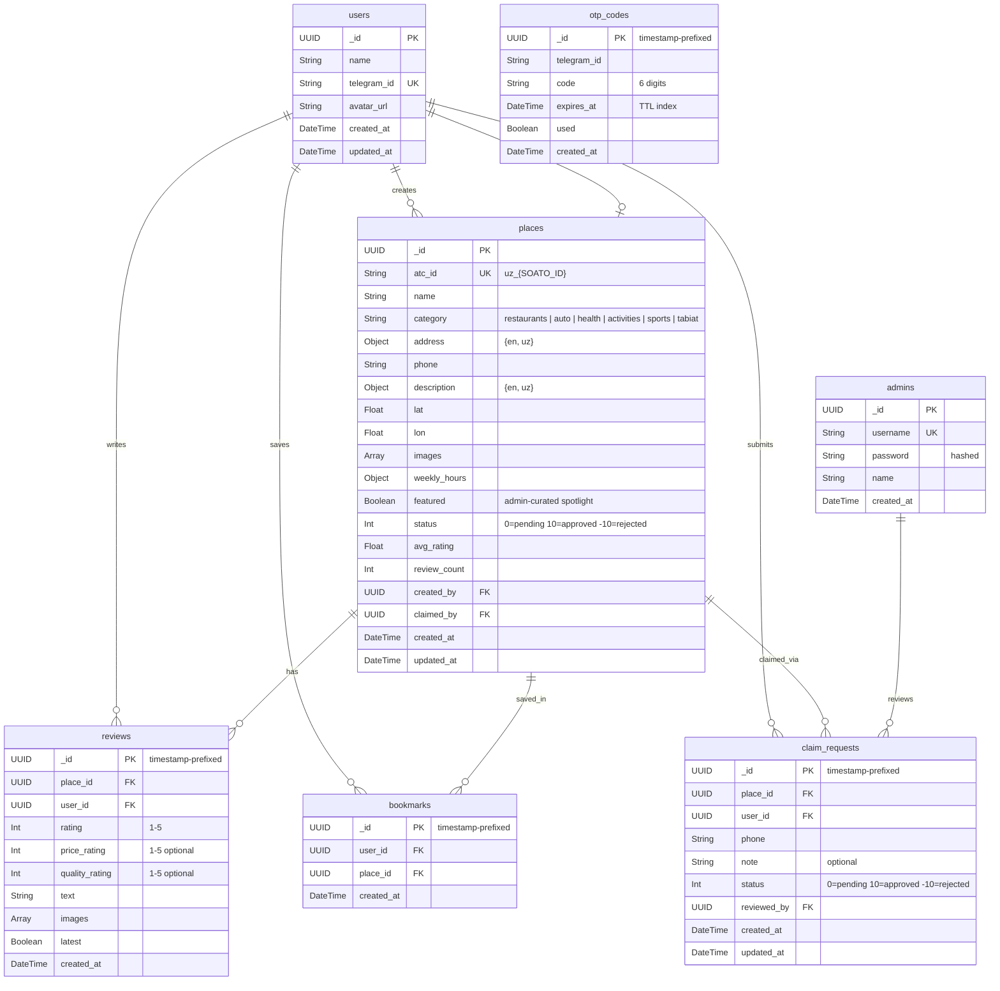

# BuYelpUz (s101) - Business Logic, Use Cases & Backend Structure

> A local review platform for Uzbekistan. Users discover places, read reviews, and leave ratings.
> Think **Yelp**, but focused on the Uzbek market with local categories like Choyxona and Tabiat.

---

## 1. Core Business Model

### How Listings Work (Yelp Model)

**Not every business owner will interact with the platform.** The listing model follows the same approach as Yelp:

1. **Any registered user can add a place.** You do not need to own a business to create a listing. If you visited a restaurant and it is not on the platform yet, you can add it yourself.
2. **Places go through moderation.** After submission, an s101 admin reviews the listing before it becomes publicly visible (status: `0/pending` -> `10/approved` or `-10/rejected`).
3. **Business owners can claim a listing.** If an owner finds their business already listed (added by a community member), they can submit a claim request with their phone number. An s101 admin contacts them to verify ownership. Once approved, the user gains edit access to that place's details.
4. **Unclaimed places remain community-managed.** The original contributor and s101 admins can edit unclaimed listings. Reviews and ratings are unaffected by claim status.

### Actors

| Actor | Description |
|-------|-------------|
| **guest** | Can browse places, search, view reviews. Cannot write reviews or add places. |
| **user** | Registered via Telegram. Can add places, write reviews, rate, bookmark, manage profile. If they have an approved claim, they see a "Business" section to manage their place. |
| **s101 admin** | Internal platform administrator. **Separate from users** (own collection, own auth). Approves/rejects places, moderates reviews, manages users, handles claim requests. |

> **Note:** There is no "owner" role in the users collection. Ownership is determined by having an approved `claim_request` for a place. The `/api/auth/me` endpoint returns an `owns_place` boolean so the frontend knows whether to show the Business section.

---

## 2. Categories

Six main categories reflecting the Uzbek market:

| Key | Name (EN) | Name (UZ) | Examples |
|-----|-----------|-----------|----------|
| `restaurants` | Restaurants | Restoranlar | Choyxona, restaurants, cafes, fast food |
| `auto` | Auto Services | Avto Xizmatlar | Car repair, car wash, petrol stations, car rental |
| `health` | Health | Salomatlik | Clinics, hospitals, pharmacies, dental |
| `activities` | Activities | Faoliyatlar | Adventure parks, aqua parks, cinemas, amusement |
| `sports` | Sports | Sport | Gyms, stadiums, swimming pools, golf clubs |
| `tabiat` | Nature (Tabiat) | Tabiat | National parks, botanical gardens, hiking trails |

---

## 3. Use Cases

### UC-1: Authentication via Telegram OTP (Register & Login)

Authentication uses a **Telegram-based OTP flow** (similar to [42.uz](https://42.uz)). There is no email/password — since virtually all Uzbek users are on Telegram, this is the single auth method.

| Field | Detail |
|-------|--------|
| **Actor** | Guest |
| **Flow** | 1. User opens the login/register page on the web app. 2. Web app shows a **6-digit code input** field and a link/username for the BuYelpUz Telegram bot. 3. User opens the TG bot and sends `/start` (or taps "Get Code"). 4. Bot generates a 6-digit OTP, stores it server-side with a TTL (e.g., 5 minutes), and sends it to the user in chat. 5. User enters the 6-digit code on the web app. 6. Web app sends the code + TG user ID to the backend. 7. Backend verifies the code. 8. **If the TG user already exists** -> login: issue JWT. **If new** -> register: create user record from TG profile (name, TG ID), then issue JWT. 9. User is redirected to home as authenticated. |
| **Postcondition** | User account exists (created if first time). User holds a valid JWT. |
| **Notes** | No separate register vs login — it's a single unified flow. First valid OTP from a new TG user auto-creates the account. |

### UC-2: Logout

| Field | Detail |
|-------|--------|
| **Actor** | Authenticated user |
| **Flow** | 1. User clicks logout. 2. JWT is discarded client-side. |

### UC-3: Browse & Search Places

| Field | Detail |
|-------|--------|
| **Actor** | Any user (guest or registered) |
| **Flow** | 1. User opens home page or search page. 2. User can browse featured/top-rated places, or enter a search query. 3. User can filter by category. 4. System returns matching places sorted by relevance. 5. User clicks a place to view its detail page. |

### UC-4: View Place Details

| Field | Detail |
|-------|--------|
| **Actor** | Any user |
| **Flow** | 1. User navigates to a place detail page. 2. System displays: name, category, address, phone, description, image gallery, weekly hours, open/closed status (derived from weekly_hours + current time), average rating, review count, location on map. 3. User can view all reviews (only latest per user shown by default). 4. User can click phone number to call directly. |

### UC-5: Add a New Place (Community-Driven)

| Field | Detail |
|-------|--------|
| **Actor** | Registered user |
| **Precondition** | User is logged in |
| **Flow** | 1. User clicks "Add a Place". 2. Fills in: name, category, address `{en, uz}`, phone, description `{en, uz}`, weekly hours, lat/lon coordinates, images. 3. System validates data (all fields required). 4. System generates `atc_id` as `uz_{SOATO_ID}`. 5. Place is saved with status `0` (pending). 6. s101 admin is notified of new submission. 7. Once approved (status `10`), place becomes visible in search and listings. |
| **Postcondition** | Place exists with status `0` (pending). Creator is recorded as `created_by`. |

### UC-6: Write a Review

| Field | Detail |
|-------|--------|
| **Actor** | Registered user |
| **Precondition** | User is logged in. Place exists and is approved (status `10`). |
| **Flow** | 1. User opens a place detail page. 2. Clicks "Write a Review". 3. Selects star rating (1-5, required). 4. Optionally sets price rating (1-5) and quality rating (1-5). 5. Writes review text. 6. Optionally uploads images. 7. Submits. 8. If the user already has a review for this place, the old review's `latest` flag is set to `false`. 9. New review is saved with `latest: true`. 10. System recalculates place `avg_rating` and `review_count` based on all `latest: true` reviews. |
| **Notes** | A user can write multiple reviews for the same place over time (e.g., revisiting after 6 months). Only the latest review per user counts toward the place's average rating. Review history is preserved. |

### UC-7: Bookmark / Save a Place

| Field | Detail |
|-------|--------|
| **Actor** | Registered user |
| **Flow** | 1. User clicks bookmark icon on a place card or detail page. 2. System toggles the saved state. 3. Saved places are **private** — only the user themselves can see their bookmarks (via profile page). |

### UC-8: Claim a Business

| Field | Detail |
|-------|--------|
| **Actor** | Registered user |
| **Precondition** | Place exists and is not yet claimed. |
| **Flow** | 1. User visits an unclaimed place page. 2. Clicks "Claim this business". 3. Fills in their phone number and optionally a note explaining how they're connected to the business. 4. System creates a claim request with status `0` (pending). 5. s101 admin sees the request and **calls the user back** to verify ownership. 6. Admin approves or rejects the claim. 7. If approved, the place's `claimed_by` is set to this user. The `/api/auth/me` response now returns `owns_place: true`, and the frontend shows a "Business" section where the user can edit their place details. |
| **Notes** | No SMS verification or document upload — we keep it simple. Admin calls the provided phone number to verify. |

### UC-9: Business Owner - Edit Place

| Field | Detail |
|-------|--------|
| **Actor** | User with an approved claim |
| **Flow** | 1. User sees the "Business" section in their profile/dashboard. 2. Can edit place details: description, phone, weekly hours, images. 3. Changes are saved directly (no moderation needed for owners). |

### UC-10: Admin - Moderate Places

| Field | Detail |
|-------|--------|
| **Actor** | s101 admin |
| **Flow** | 1. Admin logs into admin panel (separate auth from users). 2. Opens Businesses tab. 3. Sees all places with their status. 4. Can approve pending places (status `0` -> `10`), reject them (`0` -> `-10`), edit any place, or delete inappropriate ones. |

### UC-11: Admin - Moderate Reviews

| Field | Detail |
|-------|--------|
| **Actor** | s101 admin |
| **Flow** | 1. Admin opens Reviews tab. 2. Sees all reviews across places. 3. Can delete inappropriate/spam reviews. |

### UC-12: Admin - Manage Users

| Field | Detail |
|-------|--------|
| **Actor** | s101 admin |
| **Flow** | 1. Admin opens Users tab. 2. Sees all registered users with stats. 3. Can suspend or delete user accounts. |

### UC-13: User Profile Management

| Field | Detail |
|-------|--------|
| **Actor** | Registered user |
| **Flow** | 1. User navigates to profile page. 2. Views personal info (name from TG, join date), review count, saved places count. 3. Sees list of their reviews with links to places. 4. Can edit display name and avatar. |

---

## 4. Entity-Relationship Diagram (ERD)

### ID Strategy

- **UUID** is used instead of MongoDB ObjectId for all collections (ObjectId leaks metadata).
- For `reviews`, `bookmarks`, `otp_codes`, and `claim_requests`: use **timestamp-prefixed UUIDs** (e.g., `20260416T1230-550e8400-...`) so these collections are naturally ordered by creation time without needing a sort on `created_at`.
- `users` and `places` use standard UUIDs.

```
┌─────────────────────────────────────────────────────────────────────────────────┐
│                          BuYelpUz (s101) — ERD                                  │
└─────────────────────────────────────────────────────────────────────────────────┘

┌──────────────────────────┐     ┌──────────────────────────────┐
│         users             │     │          places               │
├──────────────────────────┤     ├──────────────────────────────┤
│ _id          UUID        │     │ _id            UUID          │
│ name         String      │     │ atc_id         String ‡     │
│ telegram_id  String ‡    │     │   (format: uz_{SOATO_ID})   │
│ avatar_url   String      │     │ name           String       │
│ created_at   DateTime    │     │ category       String(enum) │
│ updated_at   DateTime    │     │ address        {en, uz}     │
└──────────────────────────┘     │ phone          String       │
         │                       │ description    {en, uz}     │
         │                       │ lat            Float        │
         │                       │ lon            Float        │
         │                       │ images         [String]     │
         │                       │ weekly_hours   Object       │
         │                       │   { mon, tue, ... sun }     │
         │                       │ featured       Boolean      │
         │                       │   (admin-curated spotlight) │
         │                       │ status         Int          │
         │                       │   (0=pending, 10=approved,  │
         │                       │    -10=rejected)            │
         │                       │ avg_rating     Float        │
         │                       │ review_count   Int          │
         │                       │ created_by     UUID → users │
         │                       │ claimed_by     UUID? → users│
         │                       │ created_at     DateTime     │
         │                       │ updated_at     DateTime     │
         │                       └──────────────────────────────┘
         │                                     │
         ▼                                     ▼
┌────────────────────────────────────────────────┐
│                  reviews                        │
├────────────────────────────────────────────────┤
│ _id            UUID (timestamp-prefixed)       │
│ place_id       UUID → places                   │
│ user_id        UUID → users                    │
│ rating         Int (1-5)                       │
│ price_rating   Int? (1-5)                      │
│ quality_rating Int? (1-5)                      │
│ text           String                          │
│ images         [String]                        │
│ latest         Boolean                         │
│ created_at     DateTime                        │
└────────────────────────────────────────────────┘
  unique constraint: (place_id, user_id) WHERE latest=true


┌────────────────────────────────────────────────┐
│               bookmarks                         │
├────────────────────────────────────────────────┤
│ _id            UUID (timestamp-prefixed)       │
│ user_id        UUID → users                    │
│ place_id       UUID → places                   │
│ created_at     DateTime                        │
└────────────────────────────────────────────────┘
  private to the user — not visible to others


┌────────────────────────────────────────────────┐
│              otp_codes                          │
├────────────────────────────────────────────────┤
│ _id            UUID (timestamp-prefixed)       │
│ telegram_id    String                          │
│ code           String (6 digits)               │
│ expires_at     DateTime (TTL, e.g. 5 min)      │
│ used           Boolean                         │
│ created_at     DateTime                        │
└────────────────────────────────────────────────┘


┌────────────────────────────────────────────────┐
│             claim_requests                      │
├────────────────────────────────────────────────┤
│ _id            UUID (timestamp-prefixed)       │
│ place_id       UUID → places                   │
│ user_id        UUID → users                    │
│ phone          String                          │
│ note           String?                         │
│ status         Int                             │
│   (0=pending, 10=approved, -10=rejected)       │
│ reviewed_by    UUID? → admins                  │
│ created_at     DateTime                        │
│ updated_at     DateTime                        │
└────────────────────────────────────────────────┘


┌────────────────────────────────────────────────┐
│         admins (s101 internal)                   │
├────────────────────────────────────────────────┤
│ _id            UUID                            │
│ username       String ‡                        │
│ password       String (hashed)                 │
│ name           String                          │
│ created_at     DateTime                        │
└────────────────────────────────────────────────┘
  separate from users — these are platform operators

‡ = unique index
```

### Mermaid ERD



---

## 5. Backend API Structure

### Tech Stack
- **Language:** Go
- **Framework:** Gin
- **Database:** MongoDB
- **Auth (users):** Telegram OTP + JWT
- **Auth (admins):** Username/password + JWT (separate token)
- **TG Bot:** Go-based bot using Telegram Bot API

### Endpoint Map

#### Auth — Users (Telegram OTP)

| Method | Endpoint | Description | Auth |
|--------|----------|-------------|------|
| POST | `/api/auth/request-code` | TG bot sends a 6-digit OTP to the user's Telegram chat | No |
| POST | `/api/auth/verify-code` | Verify OTP, auto-register if new user, return JWT | No |
| GET | `/api/auth/me` | Get current user profile (includes `owns_place` bool) | Yes (user) |

#### Auth — Admins (s101 internal)

| Method | Endpoint | Description | Auth |
|--------|----------|-------------|------|
| POST | `/api/admin/auth/login` | Admin login with username/password, return JWT | No |
| GET | `/api/admin/auth/me` | Get current admin profile | Yes (admin) |

#### Users

| Method | Endpoint | Description | Auth |
|--------|----------|-------------|------|
| GET | `/api/users/:id` | Get user public profile | No |
| PUT | `/api/users/:id` | Update own profile (name, avatar) | Yes (self) |
| GET | `/api/users/:id/reviews` | Get user's reviews | No |

#### Places

| Method | Endpoint | Description | Auth |
|--------|----------|-------------|------|
| GET | `/api/places` | List places (search, category filter, pagination). Only status=10. | No |
| GET | `/api/places/featured` | Get featured places (featured=true, status=10) | No |
| GET | `/api/places/top` | Get top-rated places (status=10, sorted by avg_rating) | No |
| GET | `/api/places/:id` | Get place details (is_open derived from weekly_hours at response time) | No |
| POST | `/api/places` | Create a new place (status=0) | Yes (user) |
| PUT | `/api/places/:id` | Edit place (only if user is the claimant/owner) | Yes (owner) |

#### Reviews

| Method | Endpoint | Description | Auth |
|--------|----------|-------------|------|
| GET | `/api/places/:id/reviews` | Get reviews for a place (only latest=true by default) | No |
| POST | `/api/places/:id/reviews` | Write a review (sets old review's latest=false if exists) | Yes (user) |
| DELETE | `/api/reviews/:id` | Delete own review | Yes (author) |

#### Bookmarks (private to user)

| Method | Endpoint | Description | Auth |
|--------|----------|-------------|------|
| GET | `/api/bookmarks` | Get my bookmarked places | Yes (self) |
| POST | `/api/bookmarks/:placeId` | Bookmark a place | Yes (user) |
| DELETE | `/api/bookmarks/:placeId` | Remove bookmark | Yes (user) |

#### Claims (Business Section)

| Method | Endpoint | Description | Auth |
|--------|----------|-------------|------|
| POST | `/api/claims` | Submit a claim (phone + optional note) | Yes (user) |
| GET | `/api/claims/mine` | Get my claim requests | Yes (user) |

#### Admin (s101 internal)

| Method | Endpoint | Description | Auth |
|--------|----------|-------------|------|
| GET | `/api/admin/places` | List all places (incl. pending/rejected) | Yes (admin) |
| PUT | `/api/admin/places/:id/status` | Set place status (0, 10, -10) | Yes (admin) |
| PUT | `/api/admin/places/:id` | Edit any place | Yes (admin) |
| DELETE | `/api/admin/places/:id` | Delete place | Yes (admin) |
| GET | `/api/admin/reviews` | List all reviews | Yes (admin) |
| DELETE | `/api/admin/reviews/:id` | Delete a review | Yes (admin) |
| GET | `/api/admin/users` | List all users | Yes (admin) |
| PUT | `/api/admin/users/:id/suspend` | Suspend a user | Yes (admin) |
| GET | `/api/admin/claims` | List all claim requests | Yes (admin) |
| PUT | `/api/admin/claims/:id` | Approve (10) or reject (-10) a claim | Yes (admin) |

---

## 6. Data Flow Summary

```
Guest browses ──> Search/Filter ──> View Place ──> Read Reviews
                                         │
           ┌─────────────────────────────┘
           ▼
   Wants to interact?
           │
           ▼
   Open TG Bot -> Get OTP
           │
           ▼
   Enter 6-digit code on web
           │
           ▼
   Authenticated User
   (auto-registered if new)
           │
     ┌─────┼──────────┬──────────────┐
     ▼     ▼          ▼              ▼
  Write  Add a     Bookmark     Claim a
  Review  Place    (private)    Business
     │     │                       │
     │     ▼                       ▼
     │  Status: 0 (pending)   Status: 0 (pending)
     │     │                       │
     │     ▼                       ▼
     │  s101 admin reviews    s101 admin calls back
     │     │                       │
     │  ┌──┴──┐               ┌────┴────┐
     │  ▼     ▼               ▼         ▼
     │ 10    -10             10        -10
     │(live) (rejected)  (owns_place   (rejected)
     │                    = true)
     ▼
  latest=true
  (old review -> latest=false)
  recalculate avg_rating


= = = = = = = = = = = = = = = = = = = = =
 Business section — for users with owns_place=true
 Admin section    — for s101 platform internal admins
= = = = = = = = = = = = = = = = = = = = =
```

---

## 7. Key Business Rules

1. **Multiple reviews allowed, only latest counts.** A user can write multiple reviews for the same place over time. Each new review sets the previous one to `latest: false`. Only `latest: true` reviews are shown by default and counted in `avg_rating` / `review_count`. Unique partial index: `(place_id, user_id)` where `latest=true`.
2. **Rating recalculation.** When a new review is submitted (or a review is deleted), the place's `avg_rating` and `review_count` must be recalculated from all `latest: true` reviews.
3. **Place visibility.** Only places with `status: 10` (approved) appear in public search/listings. Pending (`0`) and rejected (`-10`) are only visible to admins and the creator.
4. **Claim uniqueness.** A place can only have one approved claim (status `10`). If a claim is already approved, new claims for the same place are rejected.
5. **`is_open` is derived, not stored.** The backend computes open/closed status from `weekly_hours` and the current time when returning place details. No `is_open` field in the DB.
6. **`featured` is an admin-curated flag.** Admins manually toggle this boolean to spotlight certain places on the home page ("editor's pick"). It is independent of rating or popularity.
7. **Bilingual fields use nested objects.** Fields like `address` and `description` are stored as `{ en: "...", uz: "..." }`. Place `name` is a single string (no translation needed).
8. **Image storage.** Image URLs are stored as string arrays. Actual files hosted on object storage (e.g., S3, Cloudflare R2) or a static uploads directory.
9. **Bookmarks are private.** Only the user can see their own bookmarks. Not visible to other users or in public profiles.
10. **Admins are not users.** The `admins` collection is separate from `users`. Admins authenticate with username/password, not Telegram. They are s101 platform operators.
11. **Status uses integers.** `0` = pending, `10` = approved, `-10` = rejected. Applies to both places and claim requests.
12. **`atc_id` format.** Every place has a unique ATC ID in the format `uz_{SOATO_ID}` for geographic identification.

---

## 8. MongoDB Index Recommendations

```javascript
// users
db.users.createIndex({ telegram_id: 1 }, { unique: true })

// admins
db.admins.createIndex({ username: 1 }, { unique: true })

// otp_codes
db.otp_codes.createIndex({ telegram_id: 1, code: 1 })
db.otp_codes.createIndex({ expires_at: 1 }, { expireAfterSeconds: 0 })  // TTL auto-cleanup

// places
db.places.createIndex({ atc_id: 1 }, { unique: true })
db.places.createIndex({ status: 1, category: 1 })
db.places.createIndex({ name: "text", "description.en": "text", "description.uz": "text" })
db.places.createIndex({ avg_rating: -1 })
db.places.createIndex({ created_by: 1 })
db.places.createIndex({ claimed_by: 1 })

// reviews — partial unique index: one latest review per user per place
db.reviews.createIndex({ place_id: 1, user_id: 1 }, { unique: true, partialFilterExpression: { latest: true } })
db.reviews.createIndex({ place_id: 1, latest: 1, created_at: -1 })
db.reviews.createIndex({ user_id: 1 })

// bookmarks
db.bookmarks.createIndex({ user_id: 1, place_id: 1 }, { unique: true })

// claim_requests
db.claim_requests.createIndex({ place_id: 1, status: 1 })
db.claim_requests.createIndex({ user_id: 1 })
```

---

## 9. Go Project Structure (Recommended)

```
s101_api/
├── main.go                  # Entry point, server startup
├── config/
│   └── config.go            # Env vars, DB URI, JWT secret, TG bot token
├── db/
│   └── mongo.go             # MongoDB client initialization
├── models/
│   ├── user.go              # User struct
│   ├── admin.go             # Admin struct (s101 internal)
│   ├── place.go             # Place struct (with nested address/description)
│   ├── review.go            # Review struct (with latest flag)
│   ├── bookmark.go          # Bookmark struct
│   ├── claim.go             # ClaimRequest struct
│   └── otp.go               # OTP code struct
├── handlers/
│   ├── auth.go              # TG OTP request, verify, me
│   ├── admin_auth.go        # Admin login, me
│   ├── places.go            # CRUD + search + featured/top
│   ├── reviews.go           # Create, list, delete reviews
│   ├── bookmarks.go         # Toggle & list bookmarks (private)
│   ├── claims.go            # Submit claim, list own claims
│   └── admin.go             # Admin-only: moderate places/reviews/users/claims
├── middleware/
│   ├── auth.go              # JWT verification for users
│   ├── admin_auth.go        # JWT verification for admins (separate)
│   └── cors.go              # CORS configuration
├── routes/
│   └── routes.go            # All route definitions
├── utils/
│   ├── response.go          # Standardized JSON responses
│   └── uuid.go              # UUID generation (standard + timestamp-prefixed)
├── bot/
│   └── telegram.go          # TG bot: /start, generate & send OTP
├── go.mod
├── go.sum
└── .env                     # MONGO_URI, JWT_SECRET, TG_BOT_TOKEN
```
